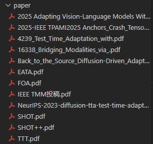
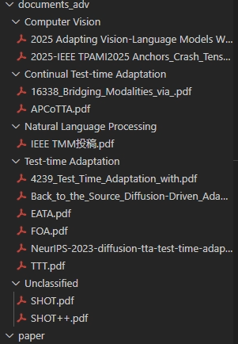
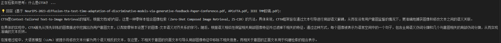
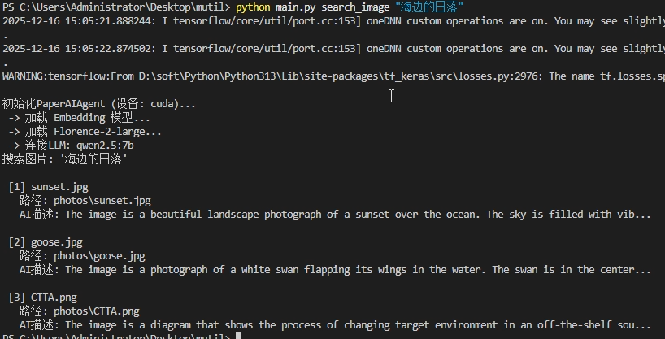

# Local AI Agent for Literature and Image Management&#x20;

## 项目简介

本项目是一个**完全本地运行的 AI Agent文献与图像管理助手**，旨在解决论文与科研图片“存不下、找不到、问不了”的问题。融合了 **LLM + 向量数据库 + 多模态模型（文本 / 图像）**，支持论文的自动分类归档、语义级检索问答（RAG），以及科研图片的深度理解与自然语言搜图。

本项目集成了**计算机视觉大模型 (Florence-2)** 和 **本地大语言模型 (Qwen-2.5)**

---

## 核心功能

###  智能论文管理

- 自动解析PDF并提取文本内容
- 基于 LLM 的**语义级论文主题分类**
- 自动按主题整理、归档论文文件夹
- 论文向量化存储，支持语义检索

### 论文语义搜索与 RAG 问答

- 使用 Embedding + 向量数据库进行语义检索
- 基于检索到的论文内容进行 **RAG（Retrieval-Augmented Generation）问答**
- 支持中文/英文自然语言提问

### 科研图片深度理解与管理

- 使用视觉大模型对图片进行**细粒度语义描述（Captioning）**
- 图像描述向量化并存入数据库
- 支持使用自然语言进行跨图片语义搜索

---

## 项目结构

```text
.
├── main.py              # 命令行入口
├── agent.py             # 核心 AI Agent 逻辑
├── script.sh            # 运行脚本
├── requirements.txt     # Python 依赖
├── documents_adv/       # 自动归档后的论文目录
├── db_advanced/         # Chroma 向量数据库（本地）
├── paper/               # 初始论文所在目录
└── photos/              # 示例图片目录
```

---

## 环境配置与依赖安装

该项目环境：操作系统为Windows11，显卡NVIDIA GeForce RTX 5060ti 16g，Python3.13.0

### 1. Python 环境

建议使用 **Python 3.11+**，并创建独立虚拟环境：

```bash
conda create -n paper_ai python=3.13
conda activate paper_ai
```

### 2. 安装依赖

```bash
pip install -r requirements.txt
```

### 3. 启动 Ollama

请确保已安装 Ollama，并拉取所需模型：

```bash
ollama pull qwen2.5:7b
```

---

## 使用说明

所有功能均通过 `main.py` 的子命令调用。

### 1 添加并智能归档单篇论文

```bash
python main.py add_paper "paper/APCoTTA.pdf" \
  --topics "Large Language Models, Computer Vision, Continual Test-time Adaptation, Test-time Adaptation, Natural Language Processing"
```

执行流程：

1. 解析 PDF 文本
2. 调用 LLM 判断论文主题
3. 将论文移动至 `./documents_adv/主题/`
4. 建立向量索引

---

### 2 批量整理混乱的论文文件夹

```bash
python main.py organize_folder "paper" \
  --topics "Large Language Models, Computer Vision, Continual Test-time Adaptation, Test-time Adaptation, Natural Language Processing"
```
下图所示为分类整理前后的文件夹结构

   


### 3 基于论文内容的 RAG 问答

```bash
python main.py chat_paper "什么是 CTTA？"
```


系统将：
1. 对问题进行向量化
2. 检索最相关的论文内容
3. 基于检索上下文调用 LLM 生成回答

---

### 4 科研图片深度索引

```bash
python main.py index_images "photos"
```

执行流程：

- 使用视觉大模型生成图片的细粒度语义描述
- 对描述进行向量化并存储

支持格式：`.jpg / .jpeg / .png`

---

### 5 使用自然语言进行搜图

```bash
python main.py search_image "海边的日落"
```



系统将返回：
- 最相关的图片文件
- 图片路径
- AI 生成的语义描述摘要

---

## 技术选型说明

### 大语言模型（LLM）

- **Qwen2.5-7B（Ollama 本地部署）**
- 论文主题分类和RAG 问答生成

### 向量表示与检索

- **Sentence-Transformers**
  - 模型：`all-MiniLM-L6-v2`
- **ChromaDB（本地持久化）**
  - 文本与图像描述统一向量检索

### 视觉大模型

- **Florence-2-large（Microsoft）**
- 用途：科研图片细粒度语义理解和高质量 Caption 生成

### 文档解析

- **PyMuPDF (fitz)**

---

## 适用场景

- 科研论文长期积累与管理
- 个人本地知识库（Paper RAG）
- 多模态科研资料（论文 + 图片）统一管理
- 对数据隐私与本地可控性有要求的研究环境

---